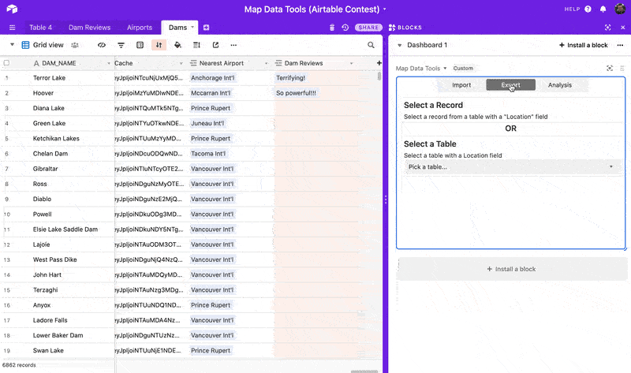

# Map Data Tools - Custom Airtable Block

Import map data to link to your data, open locations in Google Maps or on your phone with a QR code, find locations nearby other locations by comparing tables, export data to Google Earth, and more.

For a complete demo, see the Airtable Blocks Contest submission at https://devpost.com/software/map-data-tools

## How to remix this block

1. Create a new base (or you can use an existing base).

2. Create a new block in your base (see [Create a new block](https://airtable.com/developers/blocks/guides/hello-world-tutorial#create-a-new-block),
   selecting "Remix from Github" as your template.

3. From the root of your new block, run `block run`.

## License

see LICENSE.md
